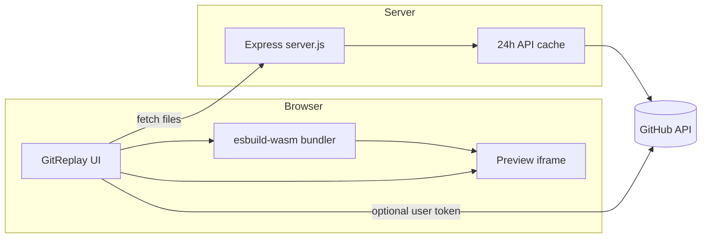

<p align="center">
  <strong>GitReplay</strong><br />
  Load any public GitHub repository and watch files build live — with a real-time website preview.
</p>

<p align="center">
  <a href="https://github.com/Delexoo/GitReplay"></a>
  <a href="https://github.com/Delexoo/GitReplay"></a>
  
  
</p>

---

## Table of contents

- [Overview](#overview)
- [Features](#features)
- [Quick start](#quick-start)
- [How it works](#how-it-works)
- [Live preview](#live-preview)
- [Authentication & tokens](#authentication--tokens)
- [Deployment](#deployment)
- [Project structure](#project-structure)
- [API reference](#api-reference)
- [Configuration](#configuration)
- [FAQ](#faq)
- [Contributing](#contributing)
- [License](#license)

---

## Overview

**GitReplay** turns a GitHub repository into an interactive studio. Paste a repo URL, explore the file tree, and **double-click any file** to watch it type out character-by-character in the code panel while the **live preview** updates in real time.

No Git clone. No local install of the target project. Just the repo URL and your browser.

<p align="center">
  <em>Built for demos, learning, code review walkthroughs, and “how was this built?” moments.</em>
</p>

---

## Features

| Area | What you get |
|------|----------------|
| **Repo loading** | Paste `github.com/owner/repo`, `owner/repo`, or a full clone URL |
| **File tree** | Collapsible tree with folder memory (persists in `localStorage`) |
| **Live replay** | Character-by-character typing with adjustable speed (0.25× – 100,000×) |
| **Progress scrubber** | Seek within the current file or across **Replay All** |
| **Parallel web build** | HTML + CSS + JS/TSX replay together for full-page previews |
| **Framework preview** | Vite / React / TypeScript projects bundled in-browser via esbuild-wasm |
| **Authentic preview** | Built `dist/` output loaded from jsDelivr when available |
| **Race mode** | Multiple files of the same type “race” to finish first |
| **Fullscreen preview** | Expand the preview panel; replay controls dock to the bottom |
| **Media preview** | Images, video, and audio open in the preview panel |
| **Rate-limit friendly** | Server-side GitHub proxy + 24h response cache |

<details>
<summary><strong>Replay modes (click to expand)</strong></summary>

<br />

| Mode | Trigger | Behavior |
|------|---------|----------|
| **Single file** | Double-click a file | Types one file; preview updates if it is web-related |
| **Parallel web** | Double-click `index.html` (or entry with linked assets) | Types HTML, CSS, and JS/TSX in sync |
| **Replay All** | **Replay All** button | Walks every file in the repo sequentially |
| **Race** | **Race** + file type (HTML / JS / CSS) | Competing files type at the same speed |

</details>

<details>
<summary><strong>Preview modes (click to expand)</strong></summary>

<br />

| Mode | When | Description |
|------|------|-------------|
| **Live build** | During replay | Partial HTML/CSS/JS injected as you type; templates expanded for visibility |
| **Authentic** | Browse / after replay | Full page with remote assets rewritten to jsDelivr |
| **Bundled** | Vite/React/TS source | esbuild-wasm bundles entry + imports; React loaded from esm.sh |
| **Media** | Image / video / audio files | Dedicated viewer in the preview iframe |

</details>

---

## Quick start

### Prerequisites

- **Node.js 20+**
- A **GitHub personal access token** (recommended for local dev and required for production)

### Local development

```bash
git clone https://github.com/Delexoo/GitReplay.git
cd GitReplay
npm install
cp .env.local.example .env.local   # then set GITHUB_TOKEN=
npm start
```

Open **[http://localhost:8080](http://localhost:8080)** and paste a public repo URL (e.g. `github.com/vitejs/vite`).

<details>
<summary><strong>Without a server token (limited)</strong></summary>

<br />

You can open `index.html` directly, but GitHub API calls will hit strict rate limits (60 requests/hour per IP). For real use, run `npm start` with `GITHUB_TOKEN` set on the server.

</details>

---

## How it works



1. **File tree** — GitHub Git Trees API (recursive) via `/api/github/*` proxy.
2. **File content** — Raw GitHub URLs with Contents API fallback.
3. **Replay engine** — `requestAnimationFrame` typing loop with speed slider and scrubber.
4. **Preview** — iframe document built from cached file contents; framework projects bundled client-side.

---

## Live preview

GitReplay supports plain static sites and modern frontend toolchains:

| Stack | Support |
|-------|---------|
| HTML / CSS / JS | Full live + authentic preview |
| Vite + React + TS/TSX | In-browser bundle (esbuild-wasm + esm.sh) |
| Built `dist/` / `build/` | jsDelivr asset URLs, no bundle needed |
| Vue / Svelte / Next.js | Not yet supported |

<details>
<summary><strong>Vite / React notes</strong></summary>

<br />

- Entry detection prefers `main.tsx`, `main.jsx`, and module scripts linked from `index.html`.
- Vite dev-only scripts (`/@vite/`, React Refresh) are stripped before preview.
- `@/` import aliases resolve to `src/`.
- If bundling fails, the preview shows a clear error — try opening `dist/index.html` if the repo ships a build.

</details>

---

## Authentication & tokens

GitReplay uses **two separate token layers**. Neither belongs in git.

### Server token (`GITHUB_TOKEN`)

| | |
|---|---|
| **Where** | `.env.local` (dev) or host dashboard (production) |
| **Who needs it** | You (the deployer) |
| **Purpose** | Proxy GitHub API for all visitors; 5,000 req/hr vs 60 |
| **Exposure** | Never sent to the browser |

### Visitor token (optional)

| | |
|---|---|
| **Where** | `sessionStorage` in the visitor's browser |
| **Lifetime** | **Current tab only** — cleared when the tab closes |
| **Purpose** | Higher limits when the shared server quota is exhausted |
| **Scopes** | None required for public repos |

<details>
<summary><strong>Creating a GitHub token</strong></summary>

<br />

1. Open [github.com/settings/tokens/new](https://github.com/settings/tokens/new)
2. Choose **Fine-grained** or **Classic**
3. For public repos: **no scopes** required
4. Copy the token once — GitHub will not show it again

**Server:** paste into `.env.local` as `GITHUB_TOKEN=ghp_...`  
**Visitor:** paste in the GitReplay welcome screen (stored in session only)

</details>

---

## Deployment

### Render (recommended)

This repo ships a [`render.yaml`](render.yaml) blueprint.

1. Push to [github.com/Delexoo/GitReplay](https://github.com/Delexoo/GitReplay)
2. [Render](https://render.com) → **New** → **Blueprint** → connect the repo
3. Set **`GITHUB_TOKEN`** as a secret environment variable when prompted
4. Deploy — health check: `GET /api/health`

<details>
<summary><strong>Manual Render setup</strong></summary>

<br />

| Setting | Value |
|---------|--------|
| Runtime | Node |
| Build command | `npm install` |
| Start command | `npm start` |
| Health check path | `/api/health` |
| `NODE_ENV` | `production` |
| `GITHUB_TOKEN` | Secret — your PAT |

</details>

<details>
<summary><strong>Other hosts (Railway, Fly.io, DigitalOcean, VPS)</strong></summary>

<br />

Any Node 20+ host works the same way:

```bash
npm install
GITHUB_TOKEN=ghp_... NODE_ENV=production node server.js
```

| Variable | Required | Description |
|----------|----------|-------------|
| `GITHUB_TOKEN` | Yes (production) | Server-side GitHub PAT |
| `NODE_ENV` | Recommended | Set to `production` |
| `PORT` | Auto on most hosts | Default `8080` |

</details>

---

## Project structure

```
GitReplay/
├── index.html          # App shell
├── css/style.css       # Layout, panels, replay controls, fullscreen
├── js/
│   ├── app.js          # UI, replay engine, file tree, session state
│   ├── github.js       # GitHub client, session token, API cache
│   ├── preview.js      # iframe preview, authentic vs live build
│   ├── bundler.js      # esbuild-wasm for Vite/React/TS preview
│   └── resize.js       # Draggable panel splits
├── server.js           # Static files + GitHub proxy + cache
├── render.yaml         # Render blueprint
├── .env.local.example  # Server token template (never commit .env.local)
└── package.json
```

---

## API reference

All routes are served from the same origin as the UI.

<details>
<summary><strong><code>GET /api/health</code></strong></summary>

<br />

```json
{
  "ok": true,
  "authenticated": true,
  "cacheEntries": 42
}
```

`authenticated: true` when `GITHUB_TOKEN` is set on the server.

</details>

<details>
<summary><strong><code>GET /api/github/*</code></strong></summary>

<br />

Proxies to `https://api.github.com/*` using the server token. Successful responses are cached in memory for **24 hours**.

</details>

<details>
<summary><strong><code>POST /api/validate-token</code></strong></summary>

<br />

Validates a visitor-supplied token before storing it in `sessionStorage`.

```json
// Request
{ "token": "ghp_..." }

// Response
{ "valid": true }
```

</details>

---

## Configuration

| File | Purpose |
|------|---------|
| `.env.local` | Local `GITHUB_TOKEN` (gitignored) |
| `render.yaml` | Render service definition |
| `.env.local.example` | Template — copy to `.env.local` |

**Never commit** `.env.local`, real tokens, or credentials.

---

## FAQ

<details>
<summary><strong>Why is my preview blank for a React repo?</strong></summary>

<br />

GitReplay bundles source files in the browser — it does not run `npm run dev`. Ensure the repo has an `index.html` that points to a TS/JS entry (e.g. `src/main.tsx`). If the repo only ships source without a build, bundling must succeed. Open the browser console for bundle errors, or try `dist/index.html` if a build is committed.

</details>

<details>
<summary><strong>Does my visitor token persist after refresh?</strong></summary>

<br />

Yes — **within the same tab**. It lives in `sessionStorage`, so it survives refresh but is **removed when the tab closes**. It is never written to `localStorage`.

</details>

<details>
<summary><strong>Can I use private repositories?</strong></summary>

<br />

Not in the current version. GitReplay targets **public** repositories. Private repo support would require scoped tokens and additional API handling.

</details>

<details>
<summary><strong>What are the GitHub rate limits?</strong></summary>

<br />

| Auth | Limit |
|------|-------|
| Unauthenticated IP | 60 requests / hour |
| Server `GITHUB_TOKEN` | 5,000 requests / hour |
| Visitor token (session) | 5,000 requests / hour for that user |

The server cache reduces repeat requests for the same repo data.

</details>

---

## Contributing

Contributions are welcome.

1. Fork [Delexoo/GitReplay](https://github.com/Delexoo/GitReplay)
2. Create a feature branch (`git checkout -b feature/my-feature`)
3. Commit your changes
4. Open a pull request

Please do not commit secrets, tokens, or `.env.local`.

---

## License

MIT © [Delexoo](https://github.com/Delexoo)

---

<p align="center">
  <a href="https://github.com/Delexoo/GitReplay">github.com/Delexoo/GitReplay</a>
</p>
