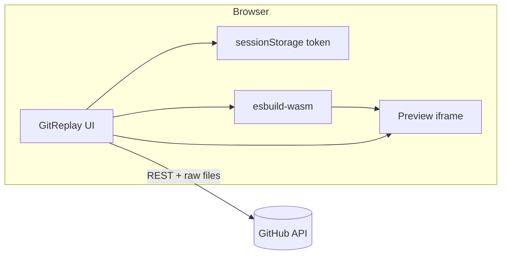

<p align="center">
  <strong>GitReplay</strong><br />
  A public web app to load any GitHub repository and watch files build live — with real-time website preview.
</p>

<p align="center">
  <a href="https://delexoo.github.io/GitReplay/"></a>
  <a href="https://github.com/Delexoo/GitReplay"></a>
  
  
</p>

<p align="center">
  <a href="https://delexoo.github.io/GitReplay/"><strong>→ Open GitReplay</strong></a>
</p>

---

## Table of contents

- [Live app](#live-app)
- [Overview](#overview)
- [Features](#features)
- [Session authentication](#session-authentication)
- [How to use](#how-to-use)
- [How it works](#how-it-works)
- [Live preview](#live-preview)
- [FAQ](#faq)
- [Contributing](#contributing)
- [License](#license)

---

## Live app

**[https://delexoo.github.io/GitReplay/](https://delexoo.github.io/GitReplay/)**

No install. No server to run. Open the link, connect your GitHub token for the current tab session (optional but recommended), paste a public repo URL, and start replaying.

---

## Overview

**GitReplay** turns a GitHub repository into an interactive studio:

1. Paste a repo URL (`github.com/owner/repo`)
2. Browse the file tree
3. **Double-click** any file to watch it type out character-by-character
4. See the **live preview** update as HTML, CSS, and JS/TSX build

Everything runs in your browser. GitReplay never stores your token on a server.

<p align="center">
  <em>Built for demos, learning, walkthroughs, and “how was this built?” moments.</em>
</p>

---

## Features

| Area | What you get |
|------|----------------|
| **Zero setup** | Public web app — just open the URL |
| **Session auth** | GitHub token stored in `sessionStorage` for the current tab only |
| **Repo loading** | Paste `github.com/owner/repo`, `owner/repo`, or a full clone URL |
| **File tree** | Collapsible tree with folder memory |
| **Live replay** | Character-by-character typing, speed 0.25× – 100,000× |
| **Progress scrubber** | Seek within a file or across **Replay All** |
| **Parallel web build** | HTML + CSS + JS/TSX replay together |
| **Framework preview** | Vite / React / TypeScript bundled in-browser (esbuild-wasm) |
| **Authentic preview** | Built `dist/` output via jsDelivr when available |
| **Race mode** | Multiple files of the same type race to finish |
| **Fullscreen preview** | Expand preview; replay controls dock to the bottom |
| **Media preview** | Images, video, and audio in the preview panel |

<details>
<summary><strong>Replay modes</strong></summary>

<br />

| Mode | Trigger | Behavior |
|------|---------|----------|
| **Single file** | Double-click a file | Types one file; preview updates if web-related |
| **Parallel web** | Double-click `index.html` | Types HTML, CSS, and JS/TSX in sync |
| **Replay All** | **Replay All** button | Walks every file sequentially |
| **Race** | **Race** + file type | Competing files type at the same speed |

</details>

<details>
<summary><strong>Preview modes</strong></summary>

<br />

| Mode | When | Description |
|------|------|-------------|
| **Live build** | During replay | Partial HTML/CSS/JS injected as you type |
| **Authentic** | Browse / after replay | Full page with assets from jsDelivr |
| **Bundled** | Vite/React/TS source | esbuild-wasm bundles entry + imports |
| **Media** | Image / video / audio | Dedicated viewer in the preview iframe |

</details>

---

## Session authentication

GitReplay uses **session-based authentication** — your GitHub personal access token lives only in the browser tab you are using.

| | |
|---|---|
| **Storage** | `sessionStorage` (never sent to GitReplay servers — there are none) |
| **Lifetime** | Current tab only — **cleared when you close the tab** |
| **Survives refresh** | Yes, within the same tab |
| **Scopes** | None required for public repositories |
| **Purpose** | Authenticate directly with GitHub’s API from your browser (5,000 req/hr vs 60 unauthenticated) |

<details>
<summary><strong>How to connect</strong></summary>

<br />

1. Open [GitReplay](https://delexoo.github.io/GitReplay/)
2. Click **Connect GitHub for this session** on the welcome screen, or the **Token** button in the header after loading a repo
3. Create a token at [github.com/settings/tokens/new](https://github.com/settings/tokens/new) — **no scopes** needed for public repos
4. Paste the token and save — it stays in this tab until you close it

</details>

<details>
<summary><strong>Privacy & security</strong></summary>

<br />

- GitReplay is a **static web app** hosted on GitHub Pages
- API calls go **directly from your browser to GitHub** — no backend, no database, no token logging
- Your token is **not** written to `localStorage`, cookies, or any server
- Closing the tab ends your session

</details>

---

## How to use

1. **Open** [delexoo.github.io/GitReplay](https://delexoo.github.io/GitReplay/)
2. **Connect** your GitHub token (recommended) for higher API limits this session
3. **Paste** a public repository URL and click **Load**
4. **Single-click** a file to browse · **Double-click** to replay it live
5. Use **Replay All**, **Race**, speed slider, and progress scrubber as needed

---

## How it works



1. **File tree** — GitHub Git Trees API (recursive), called from your browser
2. **File content** — `raw.githubusercontent.com` with Contents API fallback
3. **Replay** — `requestAnimationFrame` typing loop with scrubber
4. **Preview** — iframe document built from cached files; framework projects bundled client-side

---

## Live preview

| Stack | Support |
|-------|---------|
| HTML / CSS / JS | Full live + authentic preview |
| Vite + React + TS/TSX | In-browser bundle (esbuild-wasm + esm.sh) |
| Built `dist/` / `build/` | jsDelivr asset URLs |
| Vue / Svelte / Next.js | Not yet supported |

<details>
<summary><strong>Vite / React notes</strong></summary>

<br />

- Entry detection prefers `main.tsx`, `main.jsx`, and module scripts in `index.html`
- Vite dev scripts (`/@vite/`, React Refresh) are stripped before preview
- `@/` imports resolve to `src/`
- If bundling fails, try opening `dist/index.html` when the repo ships a build

</details>

---

## FAQ

<details>
<summary><strong>Do I need to install anything?</strong></summary>

<br />

No. GitReplay is a public website. Open the link and use it in any modern browser.

</details>

<details>
<summary><strong>Why connect a GitHub token?</strong></summary>

<br />

Without a token, GitHub limits unauthenticated API use to **60 requests per hour** per IP. Connecting your token for the session raises that to **5,000/hour** for you. The token never leaves your browser tab.

</details>

<details>
<summary><strong>Does my token persist after I close the tab?</strong></summary>

<br />

No. Session storage is wiped when the tab closes. Refreshing the same tab keeps your session.

</details>

<details>
<summary><strong>Why is my React preview blank?</strong></summary>

<br />

GitReplay bundles source in the browser — it does not run `npm run dev`. Ensure the repo has an `index.html` pointing to an entry like `src/main.tsx`, or open `dist/index.html` if a build is committed.

</details>

<details>
<summary><strong>Private repositories?</strong></summary>

<br />

Not supported yet. GitReplay targets **public** repositories.

</details>

---

## Project structure

```
GitReplay/
├── index.html          # App shell
├── css/style.css       # Layout and UI
├── js/
│   ├── app.js          # UI, replay engine, file tree
│   ├── github.js       # GitHub client + session token
│   ├── preview.js      # iframe preview
│   ├── bundler.js      # esbuild-wasm for framework preview
│   └── resize.js       # Panel resizing
└── .github/workflows/  # GitHub Pages deploy
```

---

## Contributing

1. Fork [Delexoo/GitReplay](https://github.com/Delexoo/GitReplay)
2. Create a feature branch
3. Open a pull request

Do not commit tokens or secrets.

---

## License

MIT © [Delexoo](https://github.com/Delexoo)

---

<p align="center">
  <a href="https://delexoo.github.io/GitReplay/">delexoo.github.io/GitReplay</a>
</p>
